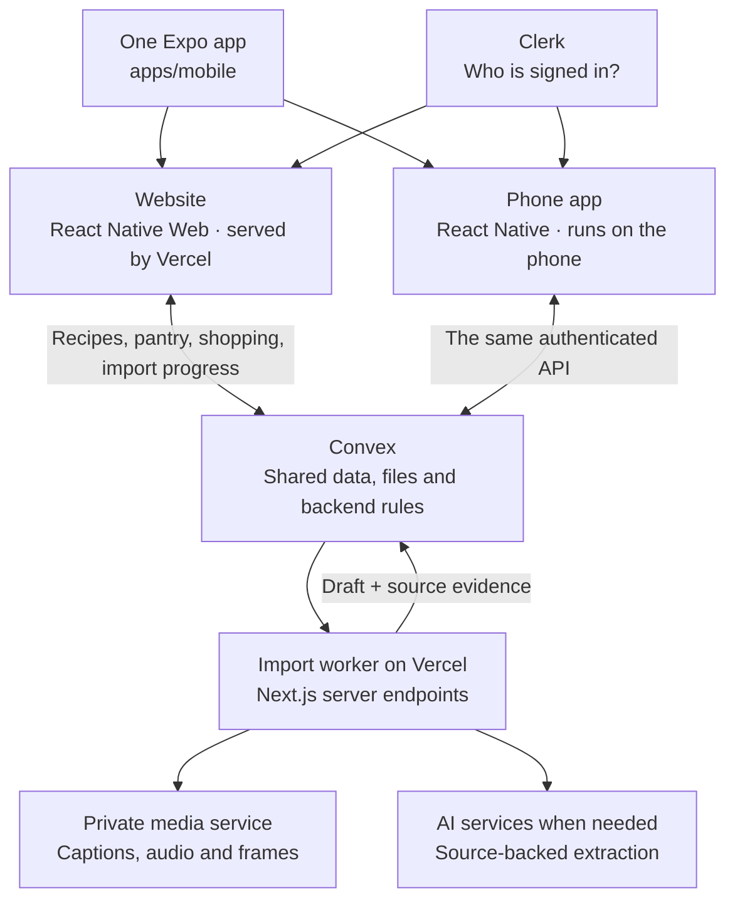
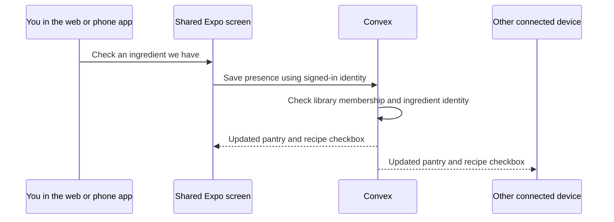

# How Purrfect Plate works

**One app design, two ways to use it, one shared kitchen.** The same Expo code creates the website and the phone app. Convex holds the recipes and pantry, so both devices see the same information when they connect to the same environment and account.

## The big picture



The website and phone app are two builds of the same application. A phone does not need to display the website inside a browser window: React Native draws native controls, while React Native Web translates those same components into browser elements.

## What each name means

| Name | Its job in our app |
| --- | --- |
| **Expo** | The tools and libraries for developing, running and building the shared app. Expo Router handles which screen you see. |
| **React Native** | The components used to describe the UI: text, buttons, inputs, lists and layouts. |
| **React Native Web** | Lets those same components work in a web browser. |
| **Convex** | The backend: recipes, photos, pantry, shopping, permissions and durable import jobs. It also notifies connected clients when data changes. |
| **Clerk** | Sign-in and identity. Convex uses that identity to check whether someone belongs to your shared library. |
| **Vercel** | Hosts the production website and server services. Your Mac is not the production server. |
| **Next.js** | A server runtime here. It keeps the import/API endpoints working and routes web visits to the Expo build. Its duplicate frontend has been removed. |
| **Metro** | The local development server Expo uses to send code to your browser or simulator while we work. It is not required for the hosted website. |

The folder called `apps/mobile` is the **web and mobile app**. Its name comes from when the phone work began; it does not mean there is another web frontend elsewhere.

## When you check an ingredient



The checkbox means **we have this at home**. It does not mark a cooking step as finished or cross out the ingredient. Quantities are still for you to check.

Shopping is a separate temporary list. You can have rice and still want to buy more rice. Copying or clearing shopping does not change the pantry. Undo restores the items that action removed, without deleting anything the other person added meanwhile.

The pantry work from the other task is included: familiar ingredient aliases, inline rename, explicit merge confirmation, and remembered choices for unclear recipe lines. The original recipe text stays unchanged.

## When you import a recipe

1. You paste a link in the Expo app. Convex records a job and returns its ID.
2. Convex starts the authenticated import worker on Vercel. The worker reads the source and, when needed, uses the private media service and AI providers.
3. The worker stores a draft and its evidence in Convex. The app receives progress updates.
4. You review and edit the draft, then save it into the shared library. The saved recipe puts the cooking content first and keeps import notes available below it.

Once the backend accepts the job, closing the app does not cancel the server work. That does **not** mean an offline phone can submit a new import: the initial request needs a connection.

Provider keys and worker credentials stay on servers. They are not shipped inside the website or phone app.

## Where the app actually lives

| Version | Where its UI runs | Does this Mac need to stay on? |
| --- | --- | --- |
| Local browser preview at `127.0.0.1:8082` | Your browser, receiving code from Metro on the Mac | Yes |
| Current simulator development app | The simulated iPhone, receiving development code from Metro | Yes |
| [Hosted website](https://purrfect-plate-theta.vercel.app) | Your browser, downloading the released web build from Vercel | No |
| Future standalone phone build | Installed on the phone, with its UI code included | No; online features still need internet |

Convex, Clerk and the production import services run remotely. A standalone phone build will use those same services without relying on your Mac. A simulator build is not an installable iPhone release.

## What happens when we change something

| Change | During development | For a released app |
| --- | --- | --- |
| A button, screen, layout or pantry interaction | The same source is reloaded in connected web/native clients | Publish a new web build; distribute a compatible native update/build separately |
| Backend rules or schema | Sync the development Convex deployment | Deploy production Convex, keeping it compatible with the clients being released |
| An actual recipe or pantry item | Connected clients on that same backend receive the update | No code deployment needed |
| Native capabilities such as a share extension | Needs an appropriate native development build | Needs a new signed native build |

**One source does not mean one release button.** Vercel publishes the website. Native builds are packaged and distributed separately. Expo's over-the-air update service could deliver compatible JavaScript/assets changes later, but it is not configured here. Publishing the website does not silently update an installed phone binary.

There are also two data environments. Local development uses `basic-poodle-462`; the production website uses `spotted-gazelle-950`. Their data is deliberately separate. A local preview and the production website can therefore show different recipe counts without anything being wrong. Web and phone builds using the same backend share the same library.

## Where we work in the code

```text
apps/mobile/src/
  app/                  Routes and navigation
  features/             Library, recipes, imports, cooking, pantry, account
  ui/                   Shared buttons, fields, typography and layout
  lib/                  Small device/browser adapters
packages/recipe-core/   Shared helpers, API types and colour palette
convex/                 Backend rules, schema, access and reactive data
app/api/                Server endpoints only
lib/recipe-import/      Source retrieval and extraction orchestration
services/media/         Private Python media processing
```

A normal product change belongs in `apps/mobile/src`. We do not reproduce it in a Next.js screen. Platform adapters are reserved for real differences, such as choosing a photo, signing in, sharing text or embedding a video.

## What is ready, and what comes later

The shared UI covers the library, recipe editing, imports, cooking controls and pantry/shopping. We can keep refining it on the web and in the simulator before arranging distribution.

Actual iPhone installation, phone-specific permissions and playback, Android verification, and TestFlight/App Store distribution are separate acceptance steps. Offline recipes, persistent cooking progress and incoming share extensions are not implemented. Dark mode and cat animations remain deferred as requested.

For development commands, see the [README](../README.md). For technical boundaries, see [Architecture and operations](architecture.md). For the exact ingredient rules, see [Pantry and shopping](pantry.md).
